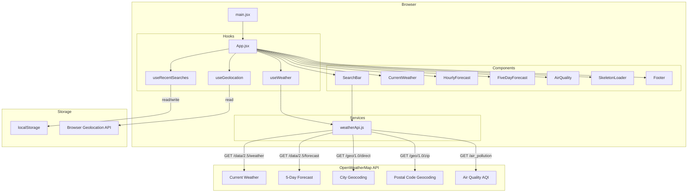
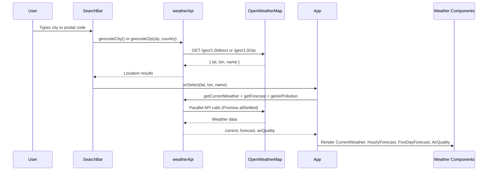

# 🌤 Weather App — 8899™

A modern React + Vite weather app with live conditions, hourly & 5-day forecasts, Air Quality Index, international postal code search, and dynamic glassmorphism UI.

**Live:** https://weather-app-abc-afb6de60.vercel.app  
**Repo:** https://github.com/karthik8899/weather-app

---

## Architecture



### Data Flow



---

## Features

| Feature | Details |
|---|---|
| 📍 Auto-location | Browser Geolocation API with graceful fallback |
| 🔍 Smart search | City name or international postal code + country selector |
| 🌡 Current weather | Temp, feels like, humidity, wind bearing, visibility, UV |
| 🌅 Sunrise / Sunset | Formatted local times on the current weather card |
| 💨 Wind direction | Cardinal direction (N, NE, SW…) from wind degrees |
| ⏰ Hourly forecast | Next 24 hours with feels-like line |
| 📅 5-day forecast | Daily high/low per day |
| 🌿 Air Quality | AQI badge (1–5), PM2.5, PM10, NO₂, O₃ chips |
| 🕑 Recent searches | Last 5 searches persisted in localStorage |
| 🌡 Unit toggle | °C / °F switch in header |
| 🎨 Dynamic gradients | Background changes per weather condition |
| 💎 Glassmorphism | Consistent `bg-white/10 backdrop-blur-md` card styling |
| 🌍 International | 20-country postal code support (US, GB, CA, AU, IN, DE, FR, JP…) |

---

## Tech Stack

| Layer | Technology |
|---|---|
| UI Framework | [React 18](https://react.dev/) + [Vite](https://vitejs.dev/) |
| Styling | [Tailwind CSS v3](https://tailwindcss.com/) |
| Weather Data | [OpenWeatherMap API](https://openweathermap.org/api) |
| Testing | [Playwright](https://playwright.dev/) (E2E) |
| Deployment | [Vercel](https://vercel.com/) |

---

## Project Structure

```
src/
├── App.jsx                   # Root: state, routing, gradient logic
├── components/
│   ├── SearchBar.jsx         # City/postal search with country selector
│   ├── CurrentWeather.jsx    # Main weather card (temp, stats, sunrise/sunset)
│   ├── HourlyForecast.jsx    # Next 24h horizontal scroll
│   ├── FiveDayForecast.jsx   # Daily high/low rows
│   ├── AirQuality.jsx        # AQI badge + pollutant chips
│   ├── SkeletonLoader.jsx    # Animate-pulse loading placeholders
│   ├── Footer.jsx            # 8899™ brand + Contact Us + copyright
│   └── Logo.jsx              # 8899™ SVG wordmark
├── hooks/
│   ├── useWeather.js         # Fetches weather + AQI, cancellation guard
│   ├── useGeolocation.js     # Browser geolocation with error handling
│   └── useRecentSearches.js  # localStorage recent searches (max 5)
└── services/
    └── weatherApi.js         # All OWM API calls (weather, forecast, geo, AQI)

tests/
├── search.spec.js            # City search, ZIP, invalid ZIP, recents
├── ui.spec.js                # Unit toggle, skeleton, city pill
└── weather-display.spec.js   # Sunrise/sunset, wind, feels-like, AQI
```

---

## Setup

### 1. Get an API key
Sign up at [openweathermap.org](https://openweathermap.org/api) and create a free API key.

### 2. Configure environment
```bash
cp .env.example .env
# Edit .env:
# VITE_OPENWEATHER_API_KEY=your_key_here
```

### 3. Install and run
```bash
npm install
npm run dev
```

Open [http://localhost:5173](http://localhost:5173)

### 4. Run tests
```bash
npm run test:e2e
```

---

## Environment Variables

| Variable | Required | Description |
|---|---|---|
| `VITE_OPENWEATHER_API_KEY` | ✅ | Your OpenWeatherMap API key |

---

*8899™ — Built with ❤️ · [Contact Us](mailto:karthikkumar.j2ee@gmail.com)*
